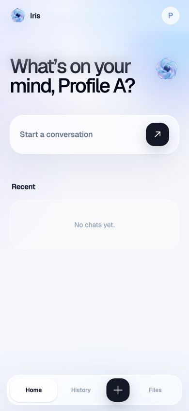
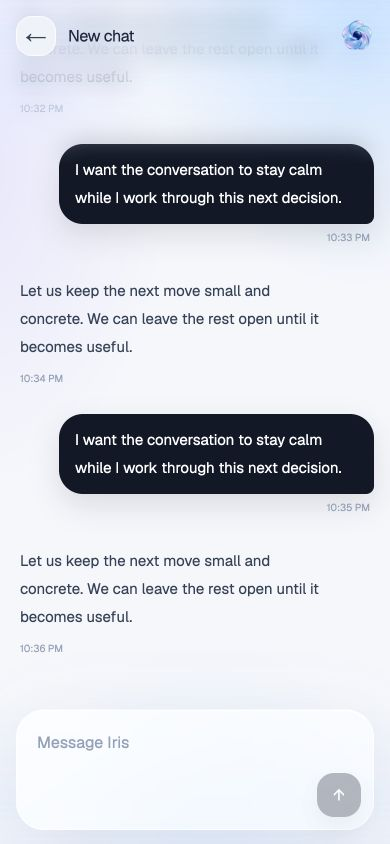

# Iris

Iris is a conversation-first personal agent with isolated profiles, chats, history, cross-chat memory, and an extensible agent runtime.

## Current progress

**Stage:** Milestones 1–4 (UI + Base, Agent Runtime, Memory, and Accountability) are complete, plus live web search from milestone 5. The current release supports persistent chats, streamed agent responses, cross-chat recall, governed memory, historical search, exact-source retrieval, source deep links, live web search with cited sources, open loops with scheduled follow-ups, merged check-ins with one-tap responses, soft-close reconciliation, conversational suppressions, tier-aware escalation tone, and a daily morning briefing. Remaining in milestone 5: calendar, location/context, Composio/Classroom, files, and artifact generation.

The public build is a mobile-first, conversation-first base with isolated profiles, persistent raw chat history, local Supabase development, and the visual language documented in [docs/UI_STANDARDS.md](docs/UI_STANDARDS.md).

### UI preview

| Home | Chat |
| --- | --- |
|  |  |

These previews use only generic seeded labels and temporary QA copy. No private personal context is included.

## What is included

- Next.js App Router, TypeScript, and Tailwind CSS
- Installable PWA basics: manifest, service worker, and app icons
- Private app PIN gate
- Exactly two locally persisted profiles
- Profile-scoped Supabase Postgres persistence
- Chat creation, history, titles, rename, timestamps, and stable UUIDs
- First-turn automatic chat titles use one additional small provider request;
  `OPENROUTER_TITLE_MODEL` can override the title model and defaults to the
  configured `OPENROUTER_MODEL`. Title generation never delays first-token
  streaming and falls back locally if it fails.
- Raw user and assistant message persistence owned by Iris
- Streaming LangChain agent responses through OpenRouter
- User-local date/time is injected into every agent run as trusted runtime context; it is not exposed as a tool.
- Versioned NDJSON run events with persisted, profile/thread-scoped tool activity
- Governed saved memory with profile isolation, revisions, stale-state reconciliation, and token-budgeted context
- Accountability: person-scoped open loops (commitments, routines, ideas) with clarify-before-commit, scheduled follow-up checks, merged conversational check-ins, one-tap Done / Not today / Drop it responses, cross-chat completion soft-close, topic suppressions, tier-aware escalation tone, and a daily morning briefing
- Cross-chat semantic and lexical retrieval with exact-message reads and source preview/deep-link actions
- Live web search through the agent (Tavily, env-gated) with inline source citations
- Simple responsive Home, Chat, History, and Files surfaces
- Mobile-first visual system with generated Iris artwork, restrained copy, and procedural edge blur
- Local Supabase CLI workflow with a safe public seed (`Profile A` / `Profile B`)
- Reserved module boundaries for skills, artifacts, and telemetry; live boundaries for memory, tools, and accountability

## Quick start

Requirements: Node.js 20.9+, Docker, and the Supabase CLI.

```bash
npm install
supabase start
supabase db reset
supabase status -o env
cp .env.example .env.local
npm run dev
```

Open [http://localhost:3000](http://localhost:3000).

`supabase db reset` applies the migration and safe public seed. Use `supabase status -o env` to get the local API URL and server-only service-role key for `.env.local`; do not commit `.env.local`.

For a hosted environment, replace the local Supabase values with the private project URL and service-role key. Personal display names are runtime database configuration and are never committed to this repository.

## Environment

```env
IRIS_APP_PIN=replace-with-a-private-pin
SUPABASE_URL=http://127.0.0.1:56321
SUPABASE_SERVICE_ROLE_KEY=your-server-only-service-role-key
OPENROUTER_API_KEY=your-server-only-openrouter-key
# Optional live web search via Tavily (server-only). Get a key at tavily.com.
# TAVILY_API_KEY=
# Server-only secret guarding the internal worker endpoints (memory workers +
# accountability sweep). Required for cron/heartbeat sweeps.
# MEMORY_WORKER_SECRET=change-me
# Per-sweep time bound for background workers; raise for slow local/free models.
# MEMORY_WORKER_MAX_DURATION_MS=25000
OPENROUTER_MODEL=openai/gpt-5.6-luna
# Optional; defaults to OPENROUTER_MODEL for the one small first-turn title request.
# OPENROUTER_TITLE_MODEL=openai/gpt-5.6-luna
# Optional; set to true to skip the automatic post-turn accountability sweep.
# ACCOUNTABILITY_SWEEP_DISABLED=false
# Optional development tracing (keep disabled unless a private tracing project is configured).
LANGCHAIN_TRACING_V2=false
# LANGCHAIN_API_KEY=your-server-only-langsmith-key
# LANGCHAIN_PROJECT=iris-development
```

`SUPABASE_SERVICE_ROLE_KEY` and `OPENROUTER_API_KEY` are server-only. Do not rename them with `NEXT_PUBLIC_` or expose them to browser code.

The model defaults to `openai/gpt-5.6-luna` when `OPENROUTER_MODEL` is omitted.

Automated tests use deterministic LangChain fake models and never call OpenRouter or another live model. The controlled live browser smoke is a separate verification step; no live provider credentials are needed for the repository test suite.

## Development commands

```bash
npm run dev       # local development
npm test          # deterministic runtime and stream tests; no network/model calls
npm run lint      # ESLint
npm run typecheck # TypeScript
npm run build     # production build
npm run start     # run the production build
npm run check:secrets # scan tracked files for credential-like content
```

Hosted GitHub Actions CI is temporarily paused. Run the checks above locally before every commit and pull request; the workflow can be restored when hosted runner access is available again.

Repository workflow is documented in [AGENTS.md](AGENTS.md), [CONTRIBUTING.md](CONTRIBUTING.md), and [PUBLIC_REPOSITORY_POLICY.md](PUBLIC_REPOSITORY_POLICY.md).

The mobile-first visual and interaction rules are documented in [docs/UI_STANDARDS.md](docs/UI_STANDARDS.md). The system map lives in [docs/ARCHITECTURE.md](docs/ARCHITECTURE.md); runtime configuration, worker endpoints, and scheduling in [docs/OPERATIONS.md](docs/OPERATIONS.md); the accountability design record in [docs/MILESTONE_4_ACCOUNTABILITY.md](docs/MILESTONE_4_ACCOUNTABILITY.md).

## Data and privacy

Profiles are separate namespaces. Server routes derive the active profile from an HTTP-only profile cookie; database queries include `profile_id`, and the schema enforces matching profile/thread ownership with composite foreign keys. Row Level Security is enabled on the core tables.

Raw messages are stored in Iris's database as canonical history. Future summaries, retrieval indexes, pinned context, and memory revisions must never replace or delete that raw history.

## Project shape

```text
app/                          Next.js routes, pages, API handlers
src/components/, src/lib/     Responsive Iris UI and client stream logic
src/server/agent/             LangChain + OpenRouter runtime, context, tools, protocol
src/server/memory/            Governed memory, retrieval, consolidation, reference history
src/server/accountability/    Open loops, sweep pipeline, check-in delivery
src/server/tools/             External tool integrations (Tavily web search)
src/server/db/                Server-only Supabase client and queries
supabase/migrations/          Database schema (RLS, composite ownership FKs)
```

Private product context and visual references are intentionally local-only and excluded from Git.

## Next stage

Milestone 5 — Tools continues: calendar, location/context, Composio/Classroom, files, and artifact generation (web search is already live). Personalized skills, voice, and telemetry remain later milestones.
